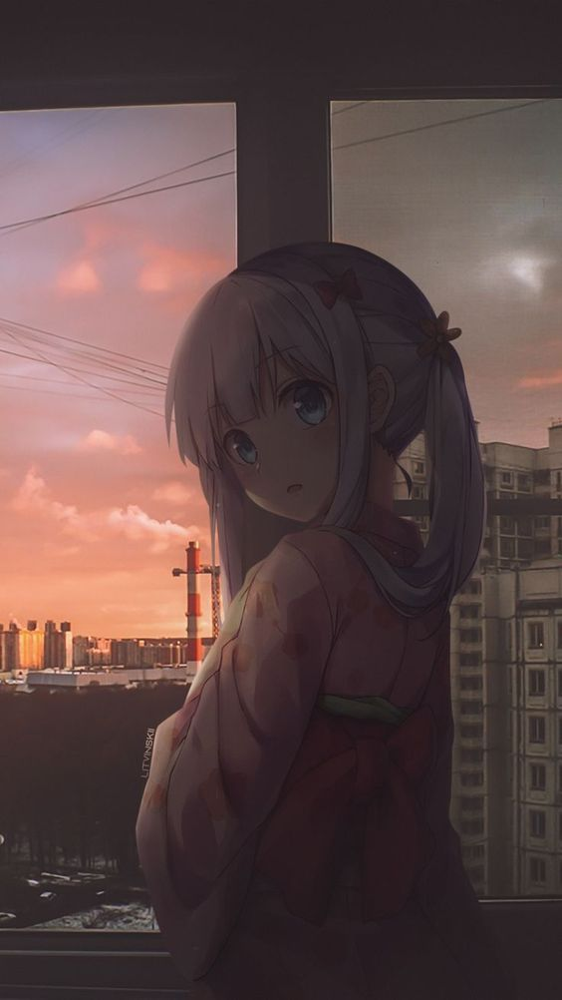

<h1 align="center">
  Hi there!
  
</h1>

## 👀 &nbsp;RavensVenix

#### Hello 👋, Nice to meet You ! 🩷

- I love to learn, develop and experiment with programs and awesome things on internet.

- I love to watch anime, quiet life, and relax.

- I love to be alone without bothering others.

 

## Visits

## 🛠 &nbsp;Tech Stuff

  
  
  
  
  
  
  
  
  
  
  
  
  
  

 

## ⚙️ &nbsp;Stats

  
  
  
  

 

## 📱 &nbsp;Contacts

  
  
  
  
  

